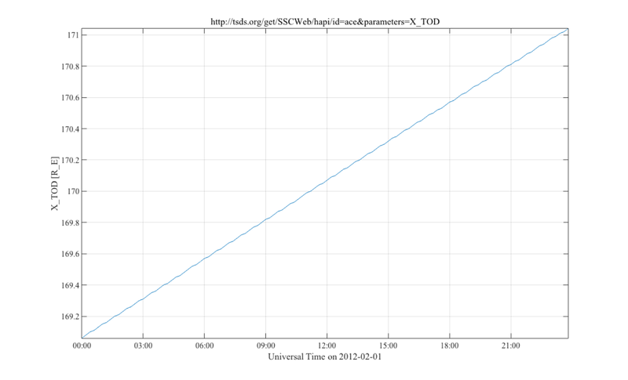
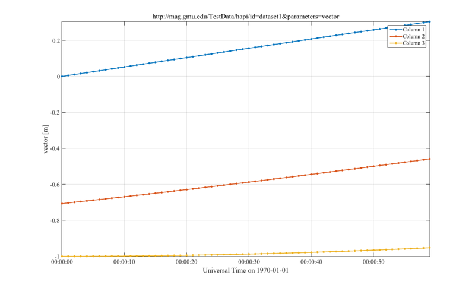
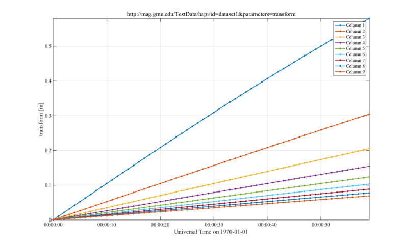
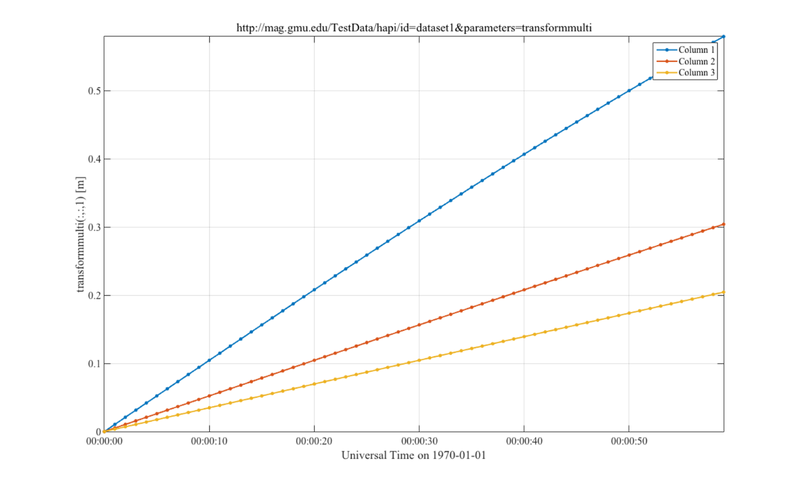
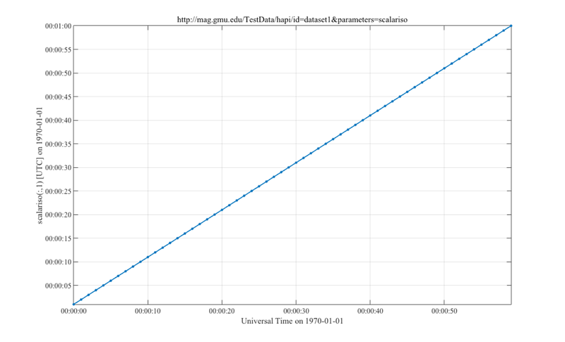
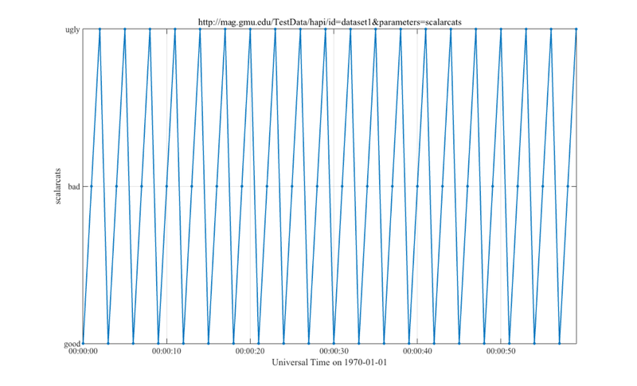

Contents
--------

-   [Use local TestData server if it is running.](#1)
-   [Download hapi.m if not found.](#2)
-   [Scalar ephemeris from SSCWeb](#3)
-   [Two scalars from SSCWeb](#4)
-   [Scalar scalar from SSCWeb](#5)
-   [Jeremy's garage temperatures](#6)
-   [Spectra from CASSINIA S/C](#7)
-   [Test Data: Vector](#8)
-   [Test Data: 10-element vector](#9)
-   [Test Data: 3x3 transformation matrix as 1-D HAPI array](#10)
-   [Test Data: 3x3 transformation matrix as 2-D HAPI array](#11)
-   [Test Data: Scalar string parameter](#12)
-   [Test Data: Scalar isotime parameter](#13)
-   [Test Data: Scalar integer parameter (with proposed category map)](#14)
-   [Test Data: Parameter that is two vectors](#15)
-   [Test Data: Vector of strings](#16)
-   [Test Data: 100-element time series with no bins](#17)
-   [Test Data: Vector of strings](#18)
-   [Test Data: All parameters](#19)
-   [Request list of known HAPI servers](#20)
-   [List datasets from a server](#21)
-   [Get metadata for all parameters in a dataset](#22)
-   [Get parameter metadata for one parameter in a dataset](#23)

Use local TestData server if it is running.<span id="1"></span>
---------------------------------------------------------------

Remove this for production.

``` codeinput
url = 'http://localhost:8999/hapi';
[str,stat]  = urlread(url);
if stat ~= 1 % Not runing test server locally.  Use public version.
    url = 'http://mag.gmu.edu/TestData/hapi';
end

use_cache = 0;
```

Download hapi.m if not found.<span id="2"></span>
-------------------------------------------------

``` codeinput
if exist('hapi','file') ~= 2
    u = 'https://raw.githubusercontent.com/hapi-server/matlab-client/master/hapi.m';
    urlwrite(u,'hapi.m');
end
```

Scalar ephemeris from SSCWeb<span id="3"></span>
------------------------------------------------

``` codeinput
server     = 'http://tsds.org/get/SSCWeb/hapi';
dataset    = 'ace';
parameters = 'X_TOD';
start      = '2012-02-01';
stop       = '2012-02-02';
opts       = struct('logging',1,'use_cache',use_cache);

% Get data and metadata
[data,meta] = hapi(server,dataset,parameters,start,stop,opts);

% Display information
data
meta
fprintf('meta.parameters = ');
meta.parameters{:}

% Plot
hapiplot(data,meta)
```

``` codeoutput
Downloading http://tsds.org/get/SSCWeb/hapi/info?id=ace&parameters=X_TOD ... Done.
Wrote hapi-data/tsds.org_get_SSCWeb_hapi/ace_X_TOD.json ...
Downloading http://tsds.org/get/SSCWeb/hapi/data?id=ace&time.min=2012-02-01&time.max=2012-02-02&parameters=X_TOD ... Done.
Reading hapi-data/tsds.org_get_SSCWeb_hapi/ace_X_TOD_20120201_20120202.csv ... Done.
Parsing hapi-data/tsds.org_get_SSCWeb_hapi/ace_X_TOD_20120201_20120202.csv ... Done.
Saving hapi-data/tsds.org_get_SSCWeb_hapi/ace_X_TOD_20120201_20120202.mat ... Done.

data = 

              Time: [120x24 char]
    DateTimeVector: [120x7 int32]
             X_TOD: [120x1 double]


meta = 

       startDate: '1997-08-25T17:48:00Z'
        stopDate: '2017-08-27T23:36:00Z'
         cadence: 'PT720S'
    creationDate: '2017-06-18T22:48:57.964Z'
            HAPI: '1.1'
          status: [1x1 struct]
      parameters: {2x1 cell}
              x_: [1x1 struct]

meta.parameters = 
ans = 

      name: 'Time'
      type: 'isotime'
    length: 25


ans = 

           name: 'X_TOD'
           type: 'double'
          units: 'R_E'
    description: 'X Position in the Geocentric Equatorial Inertial coordin...'
           fill: '1e31'

hapiplot.m: Wrote ./hapi-figures/ace_X_TOD_20120201_20120202.png
```


Two scalars from SSCWeb<span id="4"></span>
-------------------------------------------

``` codeinput
server     = 'http://tsds.org/get/SSCWeb/hapi';
dataset    = 'ace';
parameters = 'X_TOD,Y_TOD';
start      = '2012-02-01';
stop       = '2012-02-02';
opts       = struct('logging',1,'use_cache',use_cache);

% Get data and metadata
[data,meta] = hapi(server,dataset,parameters,start,stop,opts);

% Display information
data
meta
fprintf('meta.parameters = ');
meta.parameters{:}

% Plot
hapiplot(data,meta)
```

``` codeoutput
Downloading http://tsds.org/get/SSCWeb/hapi/info?id=ace&parameters=X_TOD,Y_TOD ... Done.
Wrote hapi-data/tsds.org_get_SSCWeb_hapi/ace_X_TOD-Y_TOD.json ...
Downloading http://tsds.org/get/SSCWeb/hapi/data?id=ace&time.min=2012-02-01&time.max=2012-02-02&parameters=X_TOD,Y_TOD ... Done.
Reading hapi-data/tsds.org_get_SSCWeb_hapi/ace_X_TOD-Y_TOD_20120201_20120202.csv ... Done.
Parsing hapi-data/tsds.org_get_SSCWeb_hapi/ace_X_TOD-Y_TOD_20120201_20120202.csv ... Done.
Saving hapi-data/tsds.org_get_SSCWeb_hapi/ace_X_TOD-Y_TOD_20120201_20120202.mat ... Done.

data = 

              Time: [120x24 char]
    DateTimeVector: [120x7 int32]
             X_TOD: [120x1 double]
             Y_TOD: [120x1 double]


meta = 

       startDate: '1997-08-25T17:48:00Z'
        stopDate: '2017-08-27T23:36:00Z'
         cadence: 'PT720S'
    creationDate: '2017-06-18T22:49:01.673Z'
            HAPI: '1.1'
          status: [1x1 struct]
      parameters: {3x1 cell}
              x_: [1x1 struct]

meta.parameters = 
ans = 

      name: 'Time'
      type: 'isotime'
    length: 25


ans = 

           name: 'X_TOD'
           type: 'double'
          units: 'R_E'
    description: 'X Position in the Geocentric Equatorial Inertial coordin...'
           fill: '1e31'


ans = 

           name: 'Y_TOD'
           type: 'double'
          units: 'R_E'
    description: 'Y Position in the Geocentric Equatorial Inertial coordin...'
           fill: '1e31'

hapiplot.m: Wrote ./hapi-figures/ace_X_TOD_20120201_20120202.png
hapiplot.m: Wrote ./hapi-figures/ace_Y_TOD_20120201_20120202.png
```

 
Scalar scalar from SSCWeb<span id="5"></span>
---------------------------------------------

``` codeinput
server     = 'http://tsds.org/get/SSCWeb/hapi';
dataset    = 'ace';
parameters = 'LT_GEO';
start      = '2012-02-01';
stop       = '2012-02-02';
opts       = struct('logging',1,'use_cache',use_cache);

% Get data and metadata
[data,meta] = hapi(server,dataset,parameters,start,stop,opts);

% Display information
data
meta
fprintf('meta.parameters = ');
meta.parameters{:}

% Plot
hapiplot(data,meta)
```

``` codeoutput
Downloading http://tsds.org/get/SSCWeb/hapi/info?id=ace&parameters=LT_GEO ... Done.
Wrote hapi-data/tsds.org_get_SSCWeb_hapi/ace_LT_GEO.json ...
Downloading http://tsds.org/get/SSCWeb/hapi/data?id=ace&time.min=2012-02-01&time.max=2012-02-02&parameters=LT_GEO ... Done.
Reading hapi-data/tsds.org_get_SSCWeb_hapi/ace_LT_GEO_20120201_20120202.csv ... Done.
Parsing hapi-data/tsds.org_get_SSCWeb_hapi/ace_LT_GEO_20120201_20120202.csv ... Done.
Saving hapi-data/tsds.org_get_SSCWeb_hapi/ace_LT_GEO_20120201_20120202.mat ... Done.

data = 

              Time: [120x24 char]
    DateTimeVector: [120x7 int32]
            LT_GEO: {[120x8 char]}


meta = 

       startDate: '1997-08-25T17:48:00Z'
        stopDate: '2017-08-27T23:36:00Z'
         cadence: 'PT720S'
    creationDate: '2017-06-18T22:49:05.889Z'
            HAPI: '1.1'
          status: [1x1 struct]
      parameters: {2x1 cell}
              x_: [1x1 struct]

meta.parameters = 
ans = 

      name: 'Time'
      type: 'isotime'
    length: 25


ans = 

           name: 'LT_GEO'
           type: 'string'
          units: '$H:$M:$S'
    description: 'Local time in the Geographic coordinate system, also kno...'
           fill: '99:99:99'
         length: 9

hapiplot.m: Wrote ./hapi-figures/ace_LT_GEO(:,1)_20120201_20120202.png
```


Jeremy's garage temperatures<span id="6"></span>
------------------------------------------------

He is what we call, euphemistically, 'Temperature involved' Note that hapi.m needed to allow 'float' as a data type for this to work.

``` codeinput
server     = 'http://jfaden.net/HapiServerDemo/hapi';
dataset    = '0B000800408DD710';
parameters = '';
start      = '2017-06-17T21:20:32.052';
stop       = '2017-06-18T21:20:32.520';
opts       = struct('logging',1,'use_cache',1);

[data,meta] = hapi(server, dataset, parameters, start, stop, opts);

% Display information
data
meta
fprintf('meta.parameters = ');
meta.parameters{:}

hapiplot(data,meta)
% or
% hapiplot(data,meta,'0B000800408DD710')
```

``` codeoutput
Reading hapi-data/jfaden.net_HapiServerDemo_hapi/0B000800408DD710__20170617T21:20:32.052_20170618T212032520.mat ... Done.

data = 

              Time: [4575x23 char]
    DateTimeVector: [4209x7 int32]
       Temperature: [4209x1 double]


meta = 

               HAPI: '1.1'
          createdAt: '2017-06-18T22:10Z'
         parameters: {2x1 cell}
    sampleStartDate: '2017-06-17T22:10:44.004Z'
     sampleStopDate: '2017-06-18T22:10:44.044Z'
          startDate: '2012-01-09T00:00:00.000Z'
             status: [1x1 struct]
           stopDate: '2017-06-18T22:10:44.044Z'
                 x_: [1x1 struct]

meta.parameters = 
ans = 

    length: 24
      name: 'Time'
      type: 'isotime'
     units: 'UTC'


ans = 

    description: 'temperature in garage, car'
           fill: '-1e31'
           name: 'Temperature'
           type: 'float'
          units: 'deg F'

hapiplot.m: Wrote ./hapi-figures/0B000800408DD710_Temperature_20170617T21:20:32.052_20170618T212032520.png
```


Spectra from CASSINIA S/C<span id="7"></span>
---------------------------------------------

HAPIPLOT infers that this should be plotted as a spectra because bins metadata were provided. Note that the returned data is for six hours but the plot shows that the data extend over 24 hours. This appears to be a bug in MATLAB's DATETICK function. Also note that the first parameter is named time\_array\_0 instead of Time. To allow HAPIPLOT to work, this parameter was renamed before HAPIPLOT was called. This parameter would have been plotted with log\_{10} y-axis, but there were negative values, which are not expected given the units are particles/sec/cm^2/ster/keV.

``` codeinput
server     = 'http://datashop.elasticbeanstalk.com/hapi';
dataset    = 'CASSINI_LEMMS_PHA_CHANNEL_1_SEC';
parameters = 'A';
start      = '2002-01-01';
stop       = '2002-01-02T00:06:00';
opts       = struct('logging',1,'use_cache',use_cache);

% Get data and metadata
[data,meta] = hapi(server,dataset,parameters,start,stop,opts);

% Display information
data
meta
fprintf('meta.parameters = ');
meta.parameters{:}
meta.parameters{1}.name = 'Time'; % Fix error in metadata.
% Plot
hapiplot(data,meta)
```

``` codeoutput
Downloading http://datashop.elasticbeanstalk.com/hapi/info?id=CASSINI_LEMMS_PHA_CHANNEL_1_SEC&parameters=A ... Done.
Wrote hapi-data/datashop.elasticbeanstalk.com_hapi/CASSINI_LEMMS_PHA_CHANNEL_1_SEC_A.json ...
Downloading http://datashop.elasticbeanstalk.com/hapi/data?id=CASSINI_LEMMS_PHA_CHANNEL_1_SEC&time.min=2002-01-01&time.max=2002-01-02T00:06:00&parameters=A ... Done.
Reading hapi-data/datashop.elasticbeanstalk.com_hapi/CASSINI_LEMMS_PHA_CHANNEL_1_SEC_A_20020101_20020102T000600.csv ... Done.
Parsing hapi-data/datashop.elasticbeanstalk.com_hapi/CASSINI_LEMMS_PHA_CHANNEL_1_SEC_A_20020101_20020102T000600.csv ... Done.
Saving hapi-data/datashop.elasticbeanstalk.com_hapi/CASSINI_LEMMS_PHA_CHANNEL_1_SEC_A_20020101_20020102T000600.mat ... Done.

data = 

              Time: [8037x23 char]
    DateTimeVector: [8037x7 int32]
                 A: [8037x55 double]


meta = 

               HAPI: '1.1'
             status: [1x1 struct]
         parameters: {2x1 cell}
          startDate: '2002-01-01T00:00:00.000'
           stopDate: '2016-05-12T21:38:16.000'
    sampleStartDate: '2002-01-02T00:00:00.000'
      sampleEndDate: '2002-01-02T06:00:00.000'
        description: 'Cassini MIMI LEMMS PHA channel intensities with mag ...'
       creationDate: '2017-06-18T22:49:22.000'
            cadence: 'PT1S'
                 x_: [1x1 struct]

meta.parameters = 
ans = 

           name: 'time_array_0'
           type: 'isotime'
         length: 23
          units: 'UTC'
           fill: []
    description: 'time as UTC string to milliseconds'


ans = 

           name: 'A'
           type: 'double'
          units: 'particles/sec/cm^2/ster/keV'
           size: 55
           fill: '-1.0e38'
    description: 'high energy resolution LEMMS spectrum of A channels'
           bins: [1x1 struct]

Warning: Parameter has bin ranges, but hapi_plot will not use them. 
hapiplot.m: Wrote ./hapi-figures/CASSINI_LEMMS_PHA_CHANNEL_1_SEC_A_20020101_20020102T000600.png
```


Test Data: Vector<span id="8"></span>
-------------------------------------

HAPIPLOT infers that this a parameter that should be displayed as multiple time series because the number of components of the vector is &lt; 10. Note that the metadata does not provide labels for the individual components of the vector, so "Column \#" is used in the legend. HAPI metadata should include an option to add column labels.

``` codeinput
server     = url;
dataset    = 'dataset1';
parameters = 'vector';
start      = '1970-01-01';
stop       = '1970-01-01T00:01:00';
opts       = struct('logging',1,'use_cache',use_cache);

[data,meta] = hapi(server, dataset, parameters, start, stop, opts);

% Display information
data
meta
fprintf('meta.parameters = ');
meta.parameters{:}

% Plot
hapiplot(data,meta)
% or
% hapiplot(data,meta,'vector')
```

``` codeoutput
Downloading http://localhost:8999/hapi/info?id=dataset1&parameters=vector ... Done.
Wrote hapi-data/localhost:8999_hapi/dataset1_vector.json ...
Downloading http://localhost:8999/hapi/data?id=dataset1&time.min=1970-01-01&time.max=1970-01-01T00:01:00&parameters=vector ... Done.
Reading hapi-data/localhost:8999_hapi/dataset1_vector_19700101_19700101T000100.csv ... Done.
Parsing hapi-data/localhost:8999_hapi/dataset1_vector_19700101_19700101T000100.csv ... Done.
Saving hapi-data/localhost:8999_hapi/dataset1_vector_19700101_19700101T000100.mat ... Done.

data = 

              Time: [60x23 char]
    DateTimeVector: [60x7 int32]
            vector: [60x3 double]


meta = 

          startDate: '1970-01-01'
           stopDate: '2016-12-31'
    sampleStartDate: '1970-01-01'
     sampleStopDate: '1970-01-01T00:00:09'
     x_maxDurations: [1x1 struct]
            cadence: 'PT1S'
         parameters: {2x1 cell}
               HAPI: '1.1'
             status: [1x1 struct]
                 x_: [1x1 struct]

meta.parameters = 
ans = 

      name: 'Time'
      type: 'isotime'
     units: 'UTC'
      fill: []
    length: 24


ans = 

           name: 'vector'
           type: 'double'
          units: 'm'
           fill: '-1e31'
           size: 3
    description: 'Each component is a sine wave with a 600 s period with d...'

hapiplot.m: Wrote ./hapi-figures/dataset1_vector_19700101_19700101T000100.png
```


Test Data: 10-element vector<span id="9"></span>
------------------------------------------------

HAPIPLOT infers that this a parameter that should be displayed as a spectra because the number of vector elements is &gt; 9. Note that the metadata does not provide labels for the individual components of the vector, so "Column \#" is used in the legend. HAPI metadata should include an option to add column labels.

``` codeinput
server     = url;
dataset    = 'dataset1';
parameters = 'vector';
start      = '1970-01-01';
stop       = '1970-01-01T00:01:00';
opts       = struct('logging',1,'use_cache',use_cache);

[data,meta] = hapi(server, dataset, parameters, start, stop, opts);

% Display information
data
meta
fprintf('meta.parameters = ');
meta.parameters{:}

% Plot
hapiplot(data,meta)
% or
% hapiplot(data,meta,'vector')
```

``` codeoutput
Downloading http://localhost:8999/hapi/info?id=dataset1&parameters=vector ... Done.
Wrote hapi-data/localhost:8999_hapi/dataset1_vector.json ...
Downloading http://localhost:8999/hapi/data?id=dataset1&time.min=1970-01-01&time.max=1970-01-01T00:01:00&parameters=vector ... Done.
Reading hapi-data/localhost:8999_hapi/dataset1_vector_19700101_19700101T000100.csv ... Done.
Parsing hapi-data/localhost:8999_hapi/dataset1_vector_19700101_19700101T000100.csv ... Done.
Saving hapi-data/localhost:8999_hapi/dataset1_vector_19700101_19700101T000100.mat ... Done.

data = 

              Time: [60x23 char]
    DateTimeVector: [60x7 int32]
            vector: [60x3 double]


meta = 

          startDate: '1970-01-01'
           stopDate: '2016-12-31'
    sampleStartDate: '1970-01-01'
     sampleStopDate: '1970-01-01T00:00:09'
     x_maxDurations: [1x1 struct]
            cadence: 'PT1S'
         parameters: {2x1 cell}
               HAPI: '1.1'
             status: [1x1 struct]
                 x_: [1x1 struct]

meta.parameters = 
ans = 

      name: 'Time'
      type: 'isotime'
     units: 'UTC'
      fill: []
    length: 24


ans = 

           name: 'vector'
           type: 'double'
          units: 'm'
           fill: '-1e31'
           size: 3
    description: 'Each component is a sine wave with a 600 s period with d...'

hapiplot.m: Wrote ./hapi-figures/dataset1_vector_19700101_19700101T000100.png
```


Test Data: 3x3 transformation matrix as 1-D HAPI array<span id="10"></span>
---------------------------------------------------------------------------

HAPIPLOT infers that this a parameter that should be displayed as a spectra because the number of components is &gt;= 9. Note that the metadata does not provide bins so the y-labels are "Column \#'. In this case the data provider indented to provide a time series of rotation transformation matrices (using Javascript array notation) \[Txx, Txy, Txz, Tyx, Tyy, Tyz, Tzx, Tzy, Tzz\]. HAPI metadata should include the ability to provide these labels.

``` codeinput
server     = url;
dataset    = 'dataset1';
parameters = 'transform';
start      = '1970-01-01';
stop       = '1970-01-01T00:01:00';
opts       = struct('logging',1,'use_cache',use_cache);

[data,meta] = hapi(server, dataset, parameters, start, stop, opts);

% Display information
data
meta
fprintf('meta.parameters = ');
meta.parameters{:}

% Plot
hapiplot(data,meta)
% or
% hapiplot(data,meta,'transformvector')
```

``` codeoutput
Downloading http://localhost:8999/hapi/info?id=dataset1&parameters=transform ... Done.
Wrote hapi-data/localhost:8999_hapi/dataset1_transform.json ...
Downloading http://localhost:8999/hapi/data?id=dataset1&time.min=1970-01-01&time.max=1970-01-01T00:01:00&parameters=transform ... Done.
Reading hapi-data/localhost:8999_hapi/dataset1_transform_19700101_19700101T000100.csv ... Done.
Parsing hapi-data/localhost:8999_hapi/dataset1_transform_19700101_19700101T000100.csv ... Done.
Saving hapi-data/localhost:8999_hapi/dataset1_transform_19700101_19700101T000100.mat ... Done.

data = 

              Time: [60x23 char]
    DateTimeVector: [60x7 int32]
         transform: [60x9 double]


meta = 

          startDate: '1970-01-01'
           stopDate: '2016-12-31'
    sampleStartDate: '1970-01-01'
     sampleStopDate: '1970-01-01T00:00:09'
     x_maxDurations: [1x1 struct]
            cadence: 'PT1S'
         parameters: {2x1 cell}
               HAPI: '1.1'
             status: [1x1 struct]
                 x_: [1x1 struct]

meta.parameters = 
ans = 

      name: 'Time'
      type: 'isotime'
     units: 'UTC'
      fill: []
    length: 24


ans = 

           name: 'transform'
           type: 'double'
          units: 'm'
           fill: '-1e31'
           size: 9
    description: 'Transformation matrix elements Txx, Txy, Txz, Tyx, Tyy, ...'

hapiplot.m: Wrote ./hapi-figures/dataset1_transform_19700101_19700101T000100.png
```


Test Data: 3x3 transformation matrix as 2-D HAPI array<span id="11"></span>
---------------------------------------------------------------------------

HAPIPLOT displays each layer of the matrix as three time series with y-labels tranformmult(:,:,1), transformmulti(:,:,2), and transformmulti(:,:,3) and legend labels of "Column \#", where \# = 1, 2, or 3. In this case the data provided intended to provided a time series of rotation matrices with labels (using Javascript array notation) \[\[Txx,Txy,Txz\],\[Tyx,Tyy,Tyz\],\[Tzx,Tzy,Tzz\]\]. HAPI should include the ability to provide these labels.

``` codeinput
server     = url;
dataset    = 'dataset1';
parameters = 'transformmulti';
start      = '1970-01-01';
stop       = '1970-01-01T00:01:00';
opts       = struct('logging',1,'use_cache',use_cache);

[data,meta] = hapi(server, dataset, parameters, start, stop, opts);

% Display information
data
meta
fprintf('meta.parameters = ');
meta.parameters{:}

% Plot
hapiplot(data,meta)
% or
% hapiplot(data,meta,'transformulti')
```

``` codeoutput
Downloading http://localhost:8999/hapi/info?id=dataset1&parameters=transformmulti ... Done.
Wrote hapi-data/localhost:8999_hapi/dataset1_transformmulti.json ...
Downloading http://localhost:8999/hapi/data?id=dataset1&time.min=1970-01-01&time.max=1970-01-01T00:01:00&parameters=transformmulti ... Done.
Reading hapi-data/localhost:8999_hapi/dataset1_transformmulti_19700101_19700101T000100.csv ... Done.
Parsing hapi-data/localhost:8999_hapi/dataset1_transformmulti_19700101_19700101T000100.csv ... Done.
Saving hapi-data/localhost:8999_hapi/dataset1_transformmulti_19700101_19700101T000100.mat ... Done.

data = 

              Time: [60x23 char]
    DateTimeVector: [60x7 int32]
    transformmulti: [60x3x3 double]


meta = 

          startDate: '1970-01-01'
           stopDate: '2016-12-31'
    sampleStartDate: '1970-01-01'
     sampleStopDate: '1970-01-01T00:00:09'
     x_maxDurations: [1x1 struct]
            cadence: 'PT1S'
         parameters: {2x1 cell}
               HAPI: '1.1'
             status: [1x1 struct]
                 x_: [1x1 struct]

meta.parameters = 
ans = 

      name: 'Time'
      type: 'isotime'
     units: 'UTC'
      fill: []
    length: 24


ans = 

           name: 'transformmulti'
           type: 'double'
          units: 'm'
           fill: '-1e31'
           size: [2x1 double]
    description: '3-D transformation matrix'

hapiplot.m: Wrote ./hapi-figures/dataset1_transformmulti(:,:,1)_19700101_19700101T000100.png
hapiplot.m: Wrote ./hapi-figures/dataset1_transformmulti(:,:,2)_19700101_19700101T000100.png
hapiplot.m: Wrote ./hapi-figures/dataset1_transformmulti(:,:,3)_19700101_19700101T000100.png
```

  
Test Data: Scalar string parameter<span id="12"></span>
-------------------------------------------------------

Demonstrating how HAPIPLOT handles these type of parameter.

``` codeinput
server     = url;
dataset    = 'dataset1';
parameters = 'scalarstr';
start      = '1970-01-01';
stop       = '1970-01-01T00:01:00';
opts       = struct('logging',1,'use_cache',use_cache);

[data,meta] = hapi(server, dataset, parameters, start, stop, opts);

% Display information
data
meta
fprintf('meta.parameters = ');
meta.parameters{:}

hapiplot(data,meta)
% or
% hapiplot(data,meta,'scalarstr')
```

``` codeoutput
Downloading http://localhost:8999/hapi/info?id=dataset1&parameters=scalarstr ... Done.
Wrote hapi-data/localhost:8999_hapi/dataset1_scalarstr.json ...
Downloading http://localhost:8999/hapi/data?id=dataset1&time.min=1970-01-01&time.max=1970-01-01T00:01:00&parameters=scalarstr ... Done.
Reading hapi-data/localhost:8999_hapi/dataset1_scalarstr_19700101_19700101T000100.csv ... Done.
Parsing hapi-data/localhost:8999_hapi/dataset1_scalarstr_19700101_19700101T000100.csv ... Done.
Saving hapi-data/localhost:8999_hapi/dataset1_scalarstr_19700101_19700101T000100.mat ... Done.

data = 

              Time: [60x23 char]
    DateTimeVector: [60x7 int32]
         scalarstr: {[60x3 char]}


meta = 

          startDate: '1970-01-01'
           stopDate: '2016-12-31'
    sampleStartDate: '1970-01-01'
     sampleStopDate: '1970-01-01T00:00:09'
     x_maxDurations: [1x1 struct]
            cadence: 'PT1S'
         parameters: {2x1 cell}
               HAPI: '1.1'
             status: [1x1 struct]
                 x_: [1x1 struct]

meta.parameters = 
ans = 

      name: 'Time'
      type: 'isotime'
     units: 'UTC'
      fill: []
    length: 24


ans = 

           name: 'scalarstr'
           type: 'string'
          units: []
           fill: []
         length: 4
    description: 'Status checks result; P = Pass, F = Fail'

hapiplot.m: Wrote ./hapi-figures/dataset1_scalarstr(:,1)_19700101_19700101T000100.png
```


Test Data: Scalar isotime parameter<span id="13"></span>
--------------------------------------------------------

HAPIPLOT converts the isotime string to a MATLAB DATENUM to create y-axis labels.

``` codeinput
server     = url;
dataset    = 'dataset1';
parameters = 'scalariso';
start      = '1970-01-01';
stop       = '1970-01-01T00:01:00';
opts       = struct('logging',1,'use_cache',use_cache);

[data,meta] = hapi(server, dataset, parameters, start, stop, opts);

% Display information
data
meta
fprintf('meta.parameters = ');
meta.parameters{:}

hapiplot(data,meta)
% or
% hapiplot(data,meta,'scalariso')
```

``` codeoutput
Downloading http://localhost:8999/hapi/info?id=dataset1&parameters=scalariso ... Done.
Wrote hapi-data/localhost:8999_hapi/dataset1_scalariso.json ...
Downloading http://localhost:8999/hapi/data?id=dataset1&time.min=1970-01-01&time.max=1970-01-01T00:01:00&parameters=scalariso ... Done.
Reading hapi-data/localhost:8999_hapi/dataset1_scalariso_19700101_19700101T000100.csv ... Done.
Parsing hapi-data/localhost:8999_hapi/dataset1_scalariso_19700101_19700101T000100.csv ... Done.
Saving hapi-data/localhost:8999_hapi/dataset1_scalariso_19700101_19700101T000100.mat ... Done.

data = 

              Time: [60x23 char]
    DateTimeVector: [60x7 int32]
         scalariso: {[60x20 char]}


meta = 

          startDate: '1970-01-01'
           stopDate: '2016-12-31'
    sampleStartDate: '1970-01-01'
     sampleStopDate: '1970-01-01T00:00:09'
     x_maxDurations: [1x1 struct]
            cadence: 'PT1S'
         parameters: {2x1 cell}
               HAPI: '1.1'
             status: [1x1 struct]
                 x_: [1x1 struct]

meta.parameters = 
ans = 

      name: 'Time'
      type: 'isotime'
     units: 'UTC'
      fill: []
    length: 24


ans = 

           name: 'scalariso'
           type: 'isotime'
          units: 'UTC'
           fill: '0000-00-00:T00:00:00Z'
         length: 21
    description: 'Time parameter + 1 second'

hapiplot.m: Wrote ./hapi-figures/dataset1_scalariso(:,1)_19700101_19700101T000100.png
```


Test Data: Scalar integer parameter (with proposed category map)<span id="14"></span>
-------------------------------------------------------------------------------------

Here we have a time series of integers that are intended to communicate a status represented by a string. The metadata includes a map from an integer to a string, and this map is used to generate y-axis labels.

``` codeinput
server     = url;
dataset    = 'dataset1';
parameters = 'scalarcats';
start      = '1970-01-01';
stop       = '1970-01-01T00:01:00';
opts       = struct('logging',1,'use_cache',use_cache);

[data,meta] = hapi(server, dataset, parameters, start, stop, opts);

% Display information
data
meta
fprintf('meta.parameters = ');
meta.parameters{:}

hapiplot(data,meta)
% or
% hapiplot(data,meta,'scalarcats')
```

``` codeoutput
Downloading http://localhost:8999/hapi/info?id=dataset1&parameters=scalarcats ... Done.
Wrote hapi-data/localhost:8999_hapi/dataset1_scalarcats.json ...
Downloading http://localhost:8999/hapi/data?id=dataset1&time.min=1970-01-01&time.max=1970-01-01T00:01:00&parameters=scalarcats ... Done.
Reading hapi-data/localhost:8999_hapi/dataset1_scalarcats_19700101_19700101T000100.csv ... Done.
Parsing hapi-data/localhost:8999_hapi/dataset1_scalarcats_19700101_19700101T000100.csv ... Done.
Saving hapi-data/localhost:8999_hapi/dataset1_scalarcats_19700101_19700101T000100.mat ... Done.

data = 

              Time: [60x23 char]
    DateTimeVector: [60x7 int32]
        scalarcats: [60x1 int32]


meta = 

          startDate: '1970-01-01'
           stopDate: '2016-12-31'
    sampleStartDate: '1970-01-01'
     sampleStopDate: '1970-01-01T00:00:09'
     x_maxDurations: [1x1 struct]
            cadence: 'PT1S'
         parameters: {2x1 cell}
               HAPI: '1.1'
             status: [1x1 struct]
                 x_: [1x1 struct]

meta.parameters = 
ans = 

      name: 'Time'
      type: 'isotime'
     units: 'UTC'
      fill: []
    length: 24


ans = 

           name: 'scalarcats'
           type: 'integer'
          units: []
           fill: []
    categorymap: [1x1 struct]
    description: 'Category of personality'

hapiplot.m: Wrote ./hapi-figures/dataset1_scalarcats_19700101_19700101T000100.png
```


Test Data: Parameter that is two vectors<span id="15"></span>
-------------------------------------------------------------

HAPIPLOT creates two time series plots in this case and labels the first as vectormulti(:,:,1) and second as vectormulti(:,:,2).

``` codeinput
server     = url;
dataset    = 'dataset1';
parameters = 'vectormulti';
start      = '1970-01-01';
stop       = '1970-01-01T00:01:00';
opts       = struct('logging',1,'use_cache',use_cache);

[data,meta] = hapi(server, dataset, parameters, start, stop, opts);

% Display information
data
meta
fprintf('meta.parameters = ');
meta.parameters{:}

hapiplot(data,meta)
% or
% hapiplot(data,meta,'vectormulti')
```

``` codeoutput
Downloading http://localhost:8999/hapi/info?id=dataset1&parameters=vectormulti ... Done.
Wrote hapi-data/localhost:8999_hapi/dataset1_vectormulti.json ...
Downloading http://localhost:8999/hapi/data?id=dataset1&time.min=1970-01-01&time.max=1970-01-01T00:01:00&parameters=vectormulti ... Done.
Reading hapi-data/localhost:8999_hapi/dataset1_vectormulti_19700101_19700101T000100.csv ... Done.
Parsing hapi-data/localhost:8999_hapi/dataset1_vectormulti_19700101_19700101T000100.csv ... Done.
Saving hapi-data/localhost:8999_hapi/dataset1_vectormulti_19700101_19700101T000100.mat ... Done.

data = 

              Time: [60x23 char]
    DateTimeVector: [60x7 int32]
       vectormulti: [60x3x2 double]


meta = 

          startDate: '1970-01-01'
           stopDate: '2016-12-31'
    sampleStartDate: '1970-01-01'
     sampleStopDate: '1970-01-01T00:00:09'
     x_maxDurations: [1x1 struct]
            cadence: 'PT1S'
         parameters: {2x1 cell}
               HAPI: '1.1'
             status: [1x1 struct]
                 x_: [1x1 struct]

meta.parameters = 
ans = 

      name: 'Time'
      type: 'isotime'
     units: 'UTC'
      fill: []
    length: 24


ans = 

           name: 'vectormulti'
           type: 'double'
          units: 'm'
           fill: '-1e31'
           size: [2x1 double]
    description: 'Two vectors; Each component of each vector is a sine wav...'

hapiplot.m: Wrote ./hapi-figures/dataset1_vectormulti(:,:,1)_19700101_19700101T000100.png
hapiplot.m: Wrote ./hapi-figures/dataset1_vectormulti(:,:,2)_19700101_19700101T000100.png
```

 
Test Data: Vector of strings<span id="16"></span>
-------------------------------------------------

In this unusual dataset, 3-vector of strings is given. HAPIPLOT creates three time series plots, one for each vector component.

``` codeinput
server     = url;
dataset    = 'dataset1';
parameters = 'vectorstr';
start      = '1970-01-01';
stop       = '1970-01-01T00:01:00';
opts       = struct('logging',1,'use_cache',use_cache);

[data,meta] = hapi(server, dataset, parameters, start, stop, opts);

% Display information
data
meta
fprintf('meta.parameters = ');
meta.parameters{:}

hapiplot(data,meta)
% or
% hapiplot(data,meta,'vectorstr')
```

``` codeoutput
Downloading http://localhost:8999/hapi/info?id=dataset1&parameters=vectorstr ... Done.
Wrote hapi-data/localhost:8999_hapi/dataset1_vectorstr.json ...
Downloading http://localhost:8999/hapi/data?id=dataset1&time.min=1970-01-01&time.max=1970-01-01T00:01:00&parameters=vectorstr ... Done.
Reading hapi-data/localhost:8999_hapi/dataset1_vectorstr_19700101_19700101T000100.csv ... Done.
Parsing hapi-data/localhost:8999_hapi/dataset1_vectorstr_19700101_19700101T000100.csv ... Done.
Saving hapi-data/localhost:8999_hapi/dataset1_vectorstr_19700101_19700101T000100.mat ... Done.

data = 

              Time: [60x23 char]
    DateTimeVector: [60x7 int32]
         vectorstr: {[60x3 char]  [60x3 char]  [60x3 char]}


meta = 

          startDate: '1970-01-01'
           stopDate: '2016-12-31'
    sampleStartDate: '1970-01-01'
     sampleStopDate: '1970-01-01T00:00:09'
     x_maxDurations: [1x1 struct]
            cadence: 'PT1S'
         parameters: {2x1 cell}
               HAPI: '1.1'
             status: [1x1 struct]
                 x_: [1x1 struct]

meta.parameters = 
ans = 

      name: 'Time'
      type: 'isotime'
     units: 'UTC'
      fill: []
    length: 24


ans = 

           name: 'vectorstr'
           type: 'string'
          units: []
           fill: []
         length: 4
           size: 3
    description: 'Status checks result; P = Pass, F = Fail'

hapiplot.m: Wrote ./hapi-figures/dataset1_vectorstr(:,1)_19700101_19700101T000100.png
hapiplot.m: Wrote ./hapi-figures/dataset1_vectorstr(:,2)_19700101_19700101T000100.png
hapiplot.m: Wrote ./hapi-figures/dataset1_vectorstr(:,3)_19700101_19700101T000100.png
```

  
Test Data: 100-element time series with no bins<span id="17"></span>
--------------------------------------------------------------------

HAPIPLOT assumes that this is best plotted as a spectra because the number of elements is greater than 9.

``` codeinput
server     = url;
dataset    = 'dataset1';
parameters = 'spectranobins';
start      = '1970-01-01';
stop       = '1970-01-01T00:01:00';
opts       = struct('logging',1,'use_cache',use_cache);

[data,meta] = hapi(server, dataset, parameters, start, stop, opts);

% Display information
data
meta
fprintf('meta.parameters = ');
meta.parameters{:}

hapiplot(data,meta)
% or
% hapiplot(data,meta,'spectranobins')
```

``` codeoutput
Downloading http://localhost:8999/hapi/info?id=dataset1&parameters=spectranobins ... Done.
Wrote hapi-data/localhost:8999_hapi/dataset1_spectranobins.json ...
Downloading http://localhost:8999/hapi/data?id=dataset1&time.min=1970-01-01&time.max=1970-01-01T00:01:00&parameters=spectranobins ... Done.
Reading hapi-data/localhost:8999_hapi/dataset1_spectranobins_19700101_19700101T000100.csv ... Done.
Parsing hapi-data/localhost:8999_hapi/dataset1_spectranobins_19700101_19700101T000100.csv ... Done.
Saving hapi-data/localhost:8999_hapi/dataset1_spectranobins_19700101_19700101T000100.mat ... Done.

data = 

              Time: [60x23 char]
    DateTimeVector: [60x7 int32]
     spectranobins: [60x10 double]


meta = 

          startDate: '1970-01-01'
           stopDate: '2016-12-31'
    sampleStartDate: '1970-01-01'
     sampleStopDate: '1970-01-01T00:00:09'
     x_maxDurations: [1x1 struct]
            cadence: 'PT1S'
         parameters: {2x1 cell}
               HAPI: '1.1'
             status: [1x1 struct]
                 x_: [1x1 struct]

meta.parameters = 
ans = 

      name: 'Time'
      type: 'isotime'
     units: 'UTC'
      fill: []
    length: 24


ans = 

           name: 'spectranobins'
           type: 'double'
          units: 'm'
           fill: '-1e31'
           size: 10
    description: 'A time independent 1/f spectra.'

hapiplot.m: Wrote ./hapi-figures/dataset1_spectranobins_19700101_19700101T000100.png
```


Test Data: Vector of strings<span id="18"></span>
-------------------------------------------------

In this unusual dataset, 3-vector of strings is given. HAPIPLOT creates three time series plots, one for each vector component.

``` codeinput
server     = url;
dataset    = 'dataset1';
parameters = 'vectorstr';
start      = '1970-01-01';
stop       = '1970-01-01T00:01:00';
opts       = struct('logging',1,'use_cache',use_cache);

[data,meta] = hapi(server, dataset, parameters, start, stop, opts);

% Display information
data
meta
fprintf('meta.parameters = ');
meta.parameters{:}

hapiplot(data,meta)
% or
% hapiplot(data,meta,'vectorstr')
```

``` codeoutput
Downloading http://localhost:8999/hapi/info?id=dataset1&parameters=vectorstr ... Done.
Wrote hapi-data/localhost:8999_hapi/dataset1_vectorstr.json ...
Downloading http://localhost:8999/hapi/data?id=dataset1&time.min=1970-01-01&time.max=1970-01-01T00:01:00&parameters=vectorstr ... Done.
Reading hapi-data/localhost:8999_hapi/dataset1_vectorstr_19700101_19700101T000100.csv ... Done.
Parsing hapi-data/localhost:8999_hapi/dataset1_vectorstr_19700101_19700101T000100.csv ... Done.
Saving hapi-data/localhost:8999_hapi/dataset1_vectorstr_19700101_19700101T000100.mat ... Done.

data = 

              Time: [60x23 char]
    DateTimeVector: [60x7 int32]
         vectorstr: {[60x3 char]  [60x3 char]  [60x3 char]}


meta = 

          startDate: '1970-01-01'
           stopDate: '2016-12-31'
    sampleStartDate: '1970-01-01'
     sampleStopDate: '1970-01-01T00:00:09'
     x_maxDurations: [1x1 struct]
            cadence: 'PT1S'
         parameters: {2x1 cell}
               HAPI: '1.1'
             status: [1x1 struct]
                 x_: [1x1 struct]

meta.parameters = 
ans = 

      name: 'Time'
      type: 'isotime'
     units: 'UTC'
      fill: []
    length: 24


ans = 

           name: 'vectorstr'
           type: 'string'
          units: []
           fill: []
         length: 4
           size: 3
    description: 'Status checks result; P = Pass, F = Fail'

hapiplot.m: Wrote ./hapi-figures/dataset1_vectorstr(:,1)_19700101_19700101T000100.png
hapiplot.m: Wrote ./hapi-figures/dataset1_vectorstr(:,2)_19700101_19700101T000100.png
hapiplot.m: Wrote ./hapi-figures/dataset1_vectorstr(:,3)_19700101_19700101T000100.png
```

  
Test Data: All parameters<span id="19"></span>
----------------------------------------------

If parameters='', HAPI() get all parameters in the dataset and HAPIPLOT creates (one or more, as needed) plots for each individually. This demo works, but is suppressed.

``` codeinput
if (0)
server     = 'http://mag.gmu.edu/TestData/hapi';
dataset    = 'dataset1';
parameters = '';
start      = '1970-01-01';
stop       = '1970-01-01T00:01:00';
opts       = struct('logging',1,'use_cache',use_cache);

[data,meta] = hapi(server, dataset, parameters, start, stop, opts);

data
meta
fprintf('meta.parameters = ');
meta.parameters{:}

hapiplot(data,meta)
end
```

Request list of known HAPI servers<span id="20"></span>
-------------------------------------------------------

``` codeinput
Servers = hapi()
```

``` codeoutput
Servers = 

    'http://datashop.elasticbeanstalk.com/hapi'
    'http://tsds.org/get/SSCWeb/hapi'
    'http://mag.gmu.edu/TestData/hapi'
```

List datasets from a server<span id="21"></span>
------------------------------------------------

``` codeinput
sn = 3; % Server number of interest
metad = hapi(Servers{sn})
% or
% metad = hapi(Servers{sn},opts)
```

``` codeoutput
See the interface at <a href="http://tsds.org/get/#catalog=TestData">http://tsds.org/get/#catalog=TestData</a>
to search and explore datasets from the <a href="http://mag.gmu.edu/TestData/hapi">TestData</a> HAPI Server.

metad = 

    catalog: {3x1 cell}
       HAPI: '1.1'
     status: [1x1 struct]
```

Get metadata for all parameters in a dataset<span id="22"></span>
-----------------------------------------------------------------

``` codeinput
dn = 1; % Dataset number from server number sn
metap = hapi(Servers{sn}, metad.catalog{dn}.id)
% or
% metap = hapi(Servers{sn},ids{dn},opts);
```

``` codeoutput
See the interface at <a href="http://tsds.org/get/#catalog=TestData&dataset=dataset0">http://tsds.org/get/#catalog=TestData&dataset=dataset0</a>
to search and explore parameters in this dataset from the <a href="http://mag.gmu.edu/TestData/hapi">TestData</a> HAPI Server.

metap = 

     startDate: '1970-01-01'
      stopDate: '2016-12-31'
       cadence: 'PT1M'
    parameters: {13x1 cell}
```

Get parameter metadata for one parameter in a dataset<span id="23"></span>
--------------------------------------------------------------------------

``` codeinput
pn = 2; % Parameter number pn in dataset dn from server sn
metapr = hapi(Servers{sn}, metad.catalog{dn}.id, metap.parameters{pn}.name)
% or
% metapr = hapi(Servers{sn}, metad.catalog{dn}.id, metap.parameters{pn}.name)
```

``` codeoutput
data = 

     startDate: '1970-01-01'
      stopDate: '2016-12-31'
       cadence: 'PT1M'
    parameters: {3x1 cell}


metapr = 

     startDate: '1970-01-01'
      stopDate: '2016-12-31'
       cadence: 'PT1M'
    parameters: {3x1 cell}
```

[Published with MATLAB® R2015a](http://www.mathworks.com/products/matlab/)
